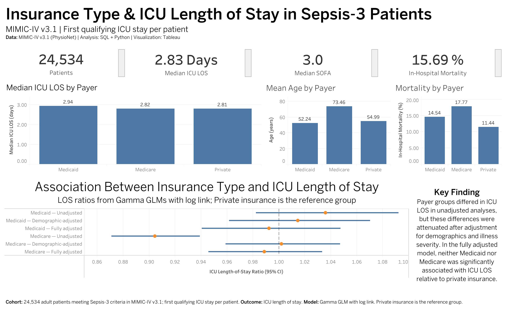

# Insurance Type & ICU Length of Stay in Sepsis-3 Patients

An analysis of the association between insurance type and ICU length of stay (LOS) among adult patients meeting Sepsis-3 criteria in MIMIC-IV v3.1, using BigQuery SQL, Python, statistical modeling, and Tableau.

**[View the interactive Tableau dashboard](https://public.tableau.com/app/profile/swati.misra/viz/InsuranceTypeICULengthofStayinSepsis-3Patients/Dashboard1?publish=yes)**



## Project Overview

Insurance status may be associated with differences in healthcare utilization, but observed differences can also reflect variation in patient demographics and clinical severity. This project evaluates whether insurance type is associated with ICU length of stay among patients with sepsis and whether any association persists after adjustment for patient characteristics and illness severity.

### Research Question

> Among adult ICU patients meeting Sepsis-3 criteria in MIMIC-IV, is insurance/payer type associated with ICU length of stay, and does that association persist after adjustment for patient characteristics and illness severity?

## Data

This project uses MIMIC-IV v3.1, a deidentified critical-care database available through PhysioNet.

The analysis combines information from the MIMIC-IV derived Sepsis-3 table with ICU stay, hospital admission, and patient-level data.

Because MIMIC-IV is credentialed-access data, no patient-level data are included in this repository. Only code, aggregated results, and visualizations are shared.

## Cohort Construction

The initial Sepsis-3 cohort contained 32,899 ICU stays among 25,570 patients.

The analysis was restricted to patients with:

- Medicare
- Medicaid
- Private insurance

Among qualifying payer groups, there were 31,648 ICU stays. Because some patients experienced multiple qualifying ICU stays, the primary analysis retained the first qualifying ICU stay per patient, producing a final cohort of 24,534 patients.

Among the qualifying stays, 4,405 patients (17.95%) had more than one ICU stay. All qualifying stays were retained for a sensitivity analysis using patient-clustered standard errors.

## Cohort Summary

| Insurance | Patients | Mean Age | Median SOFA | Mean ICU LOS | Median ICU LOS | In-Hospital Mortality |
|---|---:|---:|---:|---:|---:|---:|
| Medicaid | 3,486 | 52.24 | 3 | 5.58 days | 2.94 days | 14.54% |
| Medicare | 14,757 | 73.46 | 3 | 4.87 days | 2.82 days | 17.77% |
| Private | 6,291 | 54.99 | 3 | 5.39 days | 2.81 days | 11.44% |

Overall, the primary cohort included **24,534 patients**, with a median ICU LOS of **2.83 days**, median SOFA score of **3.0**, and in-hospital mortality of **15.69%**.

## Methods

### Unadjusted Analysis

ICU LOS was strongly right-skewed, so a Kruskal-Wallis test was used to evaluate unadjusted differences in LOS across insurance groups.

The test indicated a difference in LOS distributions across payer groups:

**H = 12.33, p = 0.002**

### Regression Modeling

Because ICU LOS is positive and strongly right-skewed, the primary analysis used Gamma generalized linear models (GLMs) with a log link.

Private insurance was used as the reference category. Three sequential models were fitted:

1. **Unadjusted:** insurance type
2. **Demographic-adjusted:** insurance + age + sex + race/ethnicity
3. **Fully adjusted:** demographic covariates + SOFA score + admission type

Exponentiated coefficients are interpreted as LOS ratios relative to privately insured patients.

## Main Results

| Model | Insurance vs. Private | LOS Ratio | 95% CI | p-value |
|---|---|---:|---:|---:|
| Unadjusted | Medicaid | 1.036 | 0.982–1.092 | 0.193 |
| Unadjusted | Medicare | 0.904 | 0.871–0.939 | <0.001 |
| Demographic-adjusted | Medicaid | 1.015 | 0.962–1.070 | 0.596 |
| Demographic-adjusted | Medicare | 1.002 | 0.959–1.047 | 0.925 |
| Fully adjusted | Medicaid | 0.993 | 0.944–1.044 | 0.773 |
| Fully adjusted | Medicare | 0.987 | 0.947–1.028 | 0.524 |

The apparent association between Medicare coverage and shorter ICU LOS in the unadjusted model was attenuated after demographic adjustment. In the fully adjusted model, neither Medicaid nor Medicare was significantly associated with ICU LOS relative to private insurance.

## Sensitivity & Robustness Analyses

Two additional analyses were used to assess whether the primary conclusion depended on cohort construction or model specification.

**Repeated ICU stays.** All qualifying ICU stays were included in a Gamma GLM using patient-clustered standard errors to account for repeated observations from the same patient. Neither Medicaid nor Medicare was significantly associated with ICU LOS.

**Alternative model specification.** A robustness analysis modeled log-transformed ICU LOS using ordinary least squares. The results were consistent with the primary analysis, with no statistically significant association for Medicaid or Medicare relative to private insurance.

## Key Finding

> Payer groups differed in ICU LOS in unadjusted analyses, but these differences were attenuated after adjustment for demographics and illness severity. In the fully adjusted model, neither Medicaid nor Medicare was significantly associated with ICU LOS relative to private insurance.

These findings suggest that the observed unadjusted differences in ICU LOS across payer groups are largely explained by differences in patient characteristics rather than an independent association between insurance type and ICU LOS.

Because this is an observational analysis, the results describe associations and should not be interpreted as causal effects of insurance coverage.

## Tools & Skills

- **SQL / Google BigQuery:** cohort extraction and relational joins across MIMIC-IV tables
- **Python:** data cleaning, cohort construction, exploratory analysis, and visualization
- **pandas / NumPy:** data manipulation and summary statistics
- **SciPy:** nonparametric hypothesis testing
- **statsmodels:** Gamma GLMs, clustered standard errors, and OLS robustness analysis
- **Tableau:** interactive dashboard and results communication
- **Clinical data:** MIMIC-IV v3.1 and Sepsis-3 cohort definition

## Repository Structure

```text
mimic-iv-sepsis-insurance-los/
├── images/
│   └── tableau_dashboard.png
├── notebooks/
│   └── 01_mimic_cohort_analysis.ipynb
├── sql/
│   └── cohort_extraction.sql
└── README.md
```

- [`notebooks/01_mimic_cohort_analysis.ipynb`](notebooks/01_mimic_cohort_analysis.ipynb) — complete Python analysis and statistical modeling workflow
- [`sql/cohort_extraction.sql`](sql/cohort_extraction.sql) — BigQuery SQL used to construct the primary analytic cohort
- [`images/tableau_dashboard.png`](images/tableau_dashboard.png) — static preview of the Tableau dashboard

## Limitations

- MIMIC-IV reflects patients treated within a single healthcare system, which may limit generalizability.
- Insurance type is measured from the available hospital admission data and may not capture all dimensions of insurance coverage or socioeconomic status.
- Residual confounding may remain despite adjustment for demographics, illness severity, and admission characteristics.
- ICU LOS is influenced by clinical, operational, and discharge-related factors that are not fully captured by the variables included in this analysis.
- The observational design does not support causal conclusions about the effect of insurance type on ICU LOS.

## Data Access

MIMIC-IV is available to credentialed users through PhysioNet. In accordance with MIMIC-IV data-use requirements, this repository does not distribute patient-level source data.

---

**Data:** MIMIC-IV v3.1 (PhysioNet)  
**Analysis:** BigQuery SQL + Python  
**Visualization:** Tableau


